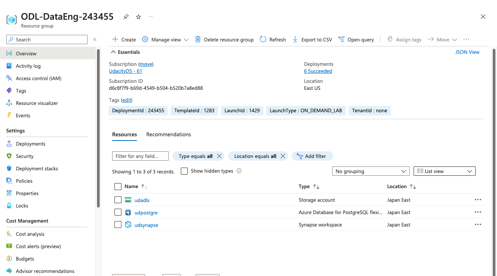
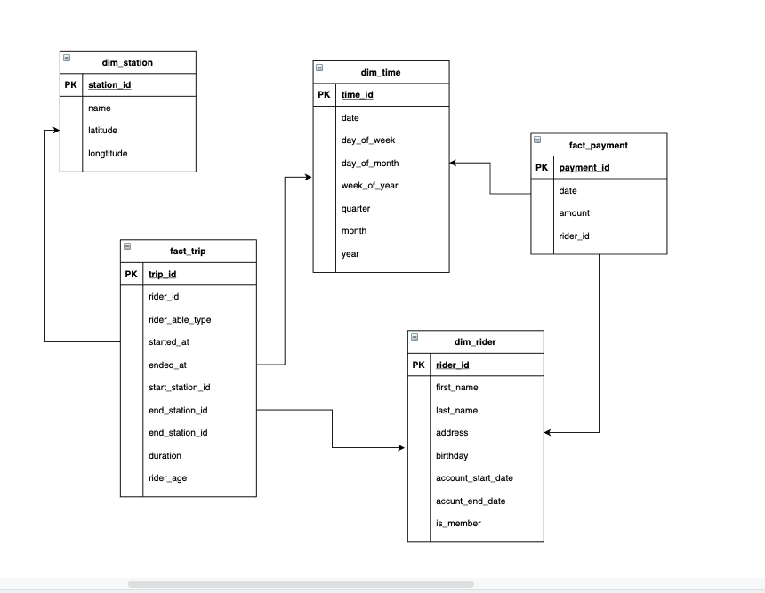
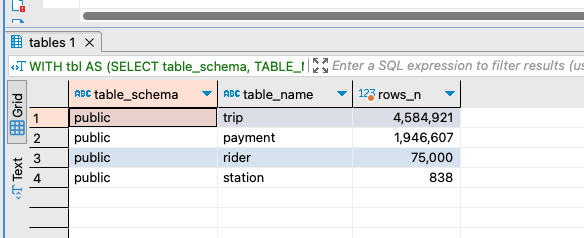
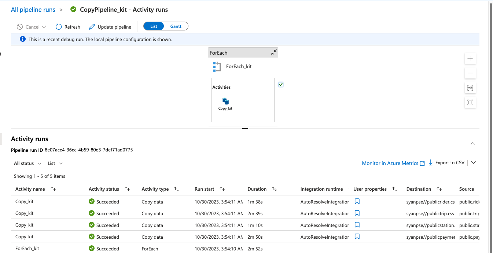
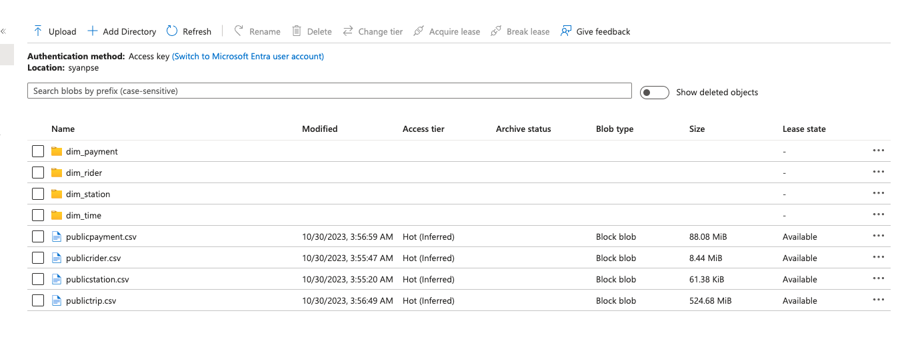

# Project Title
Building an Azure Data Warehouse for Bike Share Data Analytics
## Getting Started

Instructions for how to get a copy of the project running on your local machine.

### Installation


Install psycopg2 for using with insert data to postgre database
```
pip install psycopg2
```

## Project Instructions

This section should contain all the student deliverables for this project.

Task 1: Create your Azure resources
- Create an Azure Database for PostgreSQL.
- Create an Azure Synapse workspace.
- Use the built-in serverless SQL pool and database within the Synapse workspace



Task 2: Star-schema design



Task 3: Create the data in PostgreSQL


Task 4: EXTRACT the data from PostgreSQL



Task 5: LOAD the data into external tables in the data warehouse

- [payment](./load/load_payment.sql)
- [rider](./load/load_rider.sql)
- [station](./load/load_station.sql)
- [trip](./load/load_trip.sql)

Task 6: TRANSFORM the data to the star schema using CETAS
- [dim_payment](./create_star/dim_payment.sql)
- [dim_rider](./create_star/dim_rider.sql)
- [dim_station](./create_star/dim_station.sql)
- [dim_time](./create_star/dim_time.sql)