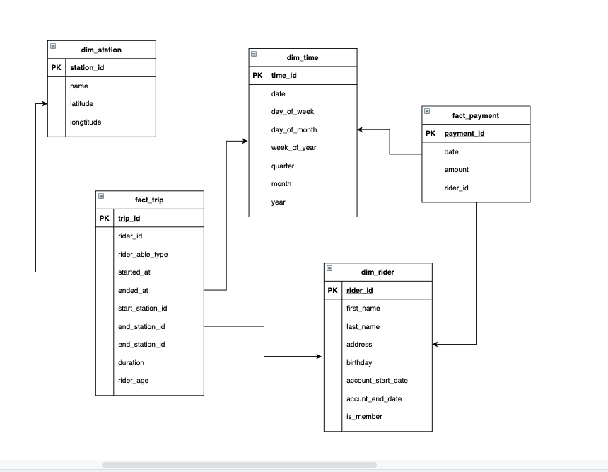

# Project Title
Building an Datalake in Azure Databrick
## Getting Started

Instructions for how to get a copy of the project running on your local machine.

## Project Instructions

This section should contain all the student deliverables for this project.

#### Task 1: Design a start schema

#### Task 2: Create ETL notbooke to process data
[ETL notebook](./ETL_notebook.ipynb)
