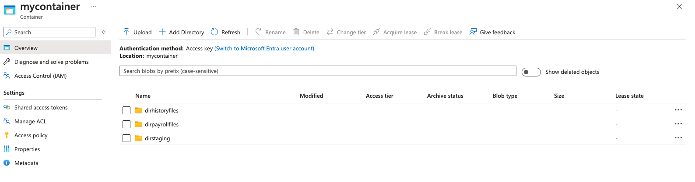
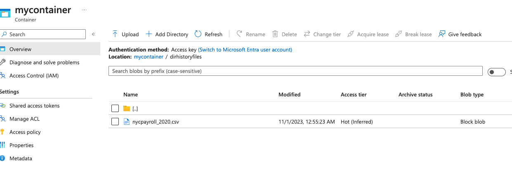
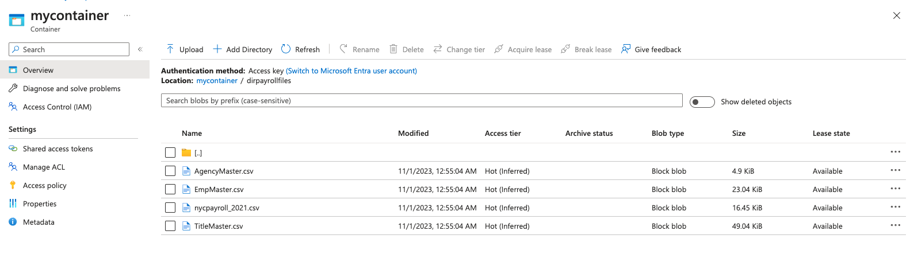
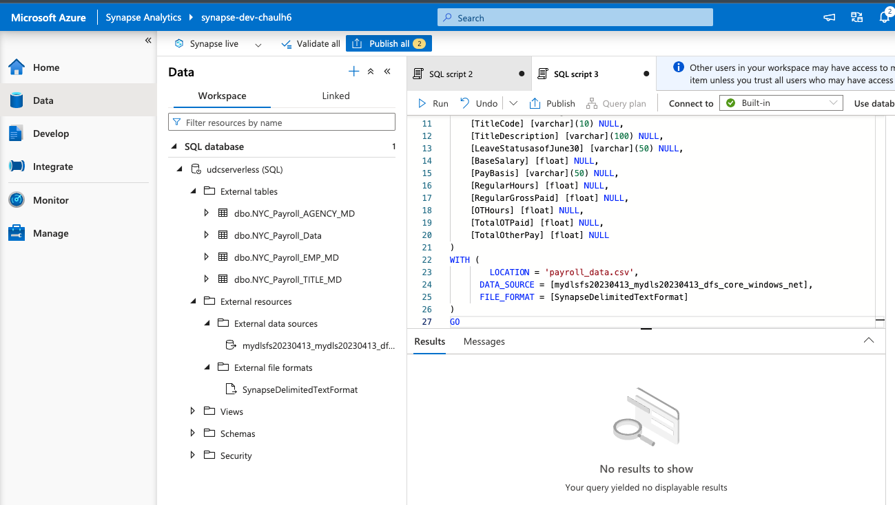
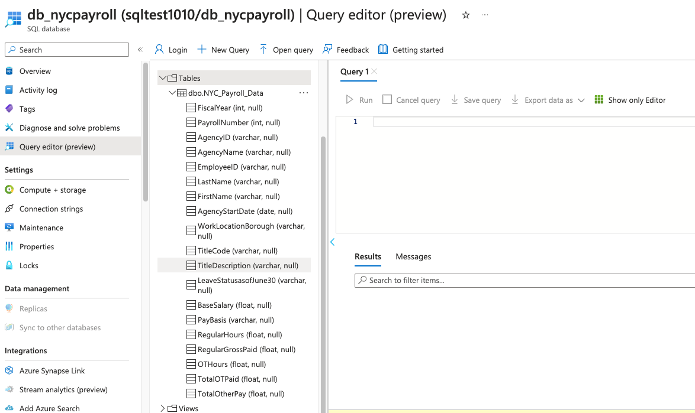
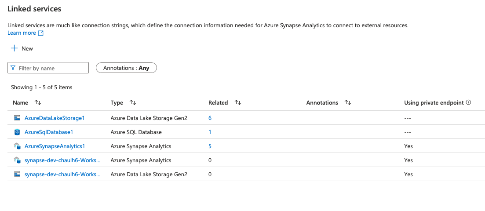
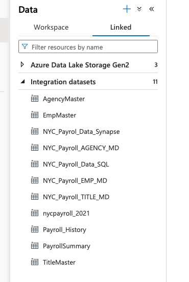
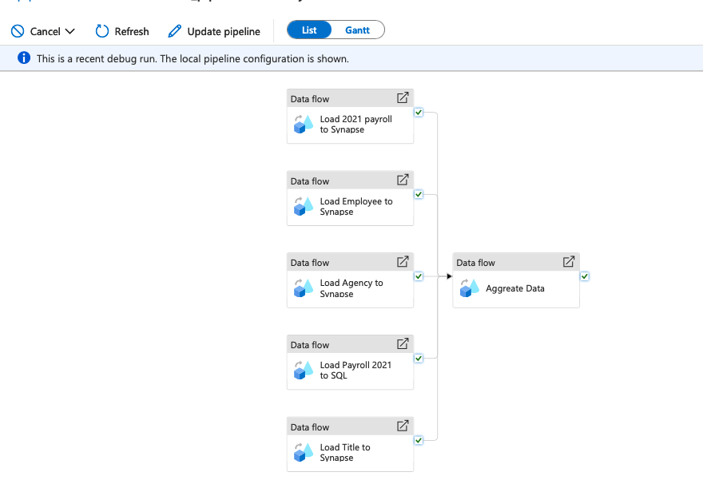
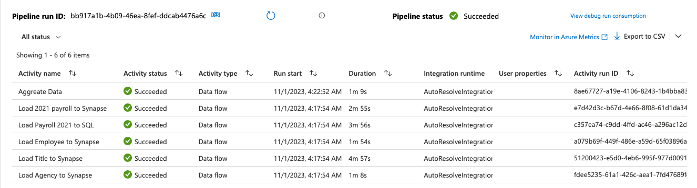

# Project Title
Building an Azure data pipeline
## Getting Started

Instructions for how to get a copy of the project running on your local machine.

## Project Instructions

This section should contain all the student deliverables for this project.

#### Step 1: Create an configure resources

- Create azure data lake with folders and uploaded .csv
  
  
  

- Create azure synapse resources
  

- Create SQL Database with table
  

#### Step 2: Create linked service

#### Step 3: Create dataset

#### Step 4: Created data flow

#### Step 5: Data Aggregation

#### Step 6: Connect to github

Link github project

https://github.com/lhc1990/azure-de-synapse/tree/develop

File zip project

[Source zip](./git_src/azure-de-synapse-develop.zip)

